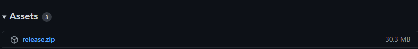

# Formula One Calendar

> ℹ️ Caso queira ler o README em português brasileiro, [clique aqui](docs/README.pt.md)<p>
> (If you want to read README in brazilian portuguese, [click here](docs/README.pt.md))

> ⚠️ [Click here](https://calendar.google.com/calendar/u/0?cid=ZjdycmM5b2V1bmVhbWhpN2dnMzlic29kczBAZ3JvdXAuY2FsZW5kYXIuZ29vZ2xlLmNvbQ) if you want the F1 season without run this app. 
> <p>The link will add you in a public calendar with the F1 races</p>

This project is an automation that add, update and remove the F1 races to a Google Calendar.<p>

- [Formula One Calendar](#formula-one-calendar)
  - [**Pre requirements**](#pre-requirements)
      - [Make your Calendar public and get Calendar Id](#make-your-calendar-public-and-get-calendar-id)
      - [Google Service Account](#google-service-account)
      - [Share your calendar with your Google Service Account Email](#share-your-calendar-with-your-google-service-account-email)
      - [.Net Core 3.1](#net-core-31)
  - [**How to Use**](#how-to-use)
      - [Github Release](#github-release)
      - [.Net Core 3.1 (Debug/Release)](#net-core-31-debugrelease)

## **Pre requirements**
#### Make your Calendar public and get Calendar Id
> [Click here](https://yabdab.zendesk.com/hc/en-us/articles/205945926-Find-Google-Calendar-ID) to learn how to let your calendar public and how to get calendar id

#### Google Service Account
> [Click here](https://support.google.com/a/answer/7378726?hl=en) to get learn how to create Google Service Account to fill some properties in [appsettings](src/Script.FormulaOneCalendar/appsettings.json)

#### Share your calendar with your Google Service Account Email
> [Click here](https://support.google.com/a/users/answer/37082?hl=en) to read how share your Google Calendar and get the ***client_email*** from your service account json

#### .Net Core 3.1
> To run this app, you will need to have [.Net Core 3.1](https://dotnet.microsoft.com/en-us/download/dotnet/3.1) installed and configured on your machine

## **How to Use**
#### Github Release
1. Access the **latest stable** [release version](https://github.com/souzaMateus99/Script.FormulaOneCalendar/releases/latest)
2. Download the **release.zip** file
    
3. You will need to **fill the properties** in **appsettings.json** file that is in **release folder**.
    ```json
    "appSettings": {
        "applicationName": "Application name (pre-filled)",
        "formulaOne": {
            "urlBase": "Formula 1 TV base url (pre-filled)",
            "apiVersion": "Formula 1 TV api version (pre-filled)",
            "language": "Formula 1 TV api language (pre-filled with portuguese)",
            "yearsPageId": [
                {
                    "year": "Year (pre-filled)",
                    "pageId": "Page ID to get race events list from year (pre-filled)"
                }
            ]
        },
        "google": {
            "calendar": {
                "id": "Google calendar ID"
            },
            "serviceAccount": {
                "email": "Google Service Account client_email value",
                "privateKey": "Google Service Account private_key value"
            }
        }
    }
    ```
4. Run the executable **(Script.FormulaOneCalendar.exe)**

#### .Net Core 3.1 (Debug/Release)
1. To use with .net core, you will need to **fill the properties** in [appsettings file](src/Script.FormulaOneCalendar/appsettings.json)
    ```json
    "appSettings": {
        "applicationName": "Application name (pre-filled)",
        "formulaOne": {
            "urlBase": "Formula 1 TV base url (pre-filled)",
            "apiVersion": "Formula 1 TV api version (pre-filled)",
            "language": "Formula 1 TV api language (pre-filled with portuguese)",
            "yearsPageId": [
                {
                    "year": "Year",
                    "pageId": "Page ID to get race events list from year"
                }
            ]
        },
        "google": {
            "calendar": {
                "id": "Google calendar ID"
            },
            "serviceAccount": {
                "email": "Google Service Account client_email value",
                "privateKey": "Google Service Account private_key value"
            }
        }
    }
    ```
2. Run the project (src/Script.FormulaOneCalendar/Script.FormulaOneCalendar.csproj)
