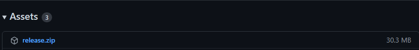

# Calendário da Formula 1

> ⚠️ [Clique aqui](https://calendar.google.com/calendar/u/0?cid=ZjdycmM5b2V1bmVhbWhpN2dnMzlic29kczBAZ3JvdXAuY2FsZW5kYXIuZ29vZ2xlLmNvbQ) se você quer obter o calendário da F1 sem precisar rodar o app.
> <p>O link irá adicionar você em um calendário público com as corridas da F1</p>

Esse projeto é uma automação que adiciona, atualiza e remove as corridas da F1 em um calendário do Google.<p>
O projeto usa a [Ergast Api](http://ergast.com/mrd/) ([Postman documentation](https://documenter.getpostman.com/view/11586746/SztEa7bL)) para obter as corridas da temporada da F1 (datas e horários de todos os eventos: Treino, Qualificação, Corrida) e usa a [Google Calendar Api](https://developers.google.com/calendar/api) para adicionar eventos no calendário do Google.

- [Calendário da Formula 1](#calendário-da-formula-1)
  - [**Pré-requisitos**](#pré-requisitos)
      - [Coloque seu calendário como público e obtenha o Id do seu calendário](#coloque-seu-calendário-como-público-e-obtenha-o-id-do-seu-calendário)
      - [Conta de serviço do Google (Google Service Account)](#conta-de-serviço-do-google-google-service-account)
      - [Compartilhe seu calendário com seu e-mail da conta de serviço do Google](#compartilhe-seu-calendário-com-seu-e-mail-da-conta-de-serviço-do-google)
      - [.Net Core 3.1 ou Docker (Não é necessário para Github Release)](#net-core-31-ou-docker-não-é-necessário-para-github-release)
  - [**Como usar**](#como-usar)
      - [Github Release](#github-release)
      - [Docker](#docker)
      - [.Net Core 3.1 (Debug/Release)](#net-core-31-debugrelease)

## **Pré-requisitos**
#### Coloque seu calendário como público e obtenha o Id do seu calendário
> [Clique aqui](https://yabdab.zendesk.com/hc/en-us/articles/205945926-Find-Google-Calendar-ID) para aprender como deixar seu calendário público e como obter seu Id do calendário

#### Conta de serviço do Google (Google Service Account)
> [Clique aqui](https://support.google.com/a/answer/7378726?hl=en) para aprender como criar sua conta de serviço do Google para preencher algumas propriedades no [appsettings](src/Script.FormulaOneCalendar/appsettings.json)

#### Compartilhe seu calendário com seu e-mail da conta de serviço do Google
> [Clique aqui](https://support.google.com/a/users/answer/37082?hl=en) para ler como compartilhar seu calendário do Google com seu e-mail da conta de serviço (client_email)

#### .Net Core 3.1 ou Docker (Não é necessário para Github Release)
> Para rodar esse app, você precisará ter [.Net Core 3.1](https://dotnet.microsoft.com/en-us/download/dotnet/3.1) ou [Docker](https://www.docker.com/get-started) instalado e configurado na sua máquina

## **Como usar**
#### Github Release
1. Acesse a última [versão estável](https://github.com/souzaMateus99/Script.FormulaOneCalendar/releases)
2. Baixe o arquivo **release.zip**
    
3. Você precisará **preencher as propriedades** do arquivo **appsettings.json** que estará na **pasta release**
    ```json
    "appSettings": {
        "applicationName": "nome da aplicação (preenchimento automático)",
        "ergastApi": {
            "urlBase": "url da Api Ergast (preenchimento automático)"
        },
        "google": {
            "calendar": {
                "id": "Id do calendário do Google"
            },
            "serviceAccount": {
                "email": "client_email da conta de serviço do Google",
                "privateKey": "private_key da conta de serviço do Google"
            }
        }
    }
    ```
4. Rodar o executável **(Script.FormulaOneCalendar.exe)**

#### Docker
1. Para usar com Docker, você precisará **preencher as variáveis de ambiente** no [Dockerfile](Dockerfile)
    ```dockerfile
    ENV ApplicationName "nome da aplicação (preenchimento automático)"
    ENV ErgastApiUrl "url da Api Ergast (preenchimento automático)"
    ENV GoogleCalendarId "Id do calendário do Google"
    ENV ServiceAccountEmail "client_email da conta de serviço do Google"
    ENV ServiceAccountPrivateKey "private_key da conta de serviço do Google"
    ```
2. Gerar (compilar) a imagem docker
    ```powershell
    docker build . -t imageName
    ```
3. Rodar a imagem docker
    ```powershell
    docker run imageName
    ```
> ℹ️ Mude o **imageName** para o nome que você quiser da sua imagem docker

#### .Net Core 3.1 (Debug/Release)
1. Para usar com .Net Core, você precisará **preencher as propriedades** do arquivo [appsettings](src/Script.FormulaOneCalendar/appsettings.json)    
    ```json
    "appSettings": {
        "applicationName": "nome da aplicação (preenchimento automático)",
        "ergastApi": {
            "urlBase": "url da Api Ergast (preenchimento automático)"
        },
        "google": {
            "calendar": {
                "id": "Id do calendário do Google"
            },
            "serviceAccount": {
                "email": "client_email da conta de serviço do Google",
                "privateKey": "private_key da conta de serviço do Google"
            }
        }
    }
    ```
2. Rodar o projeto (src/Script.FormulaOneCalendar/Script.FormulaOneCalendar.csproj)
